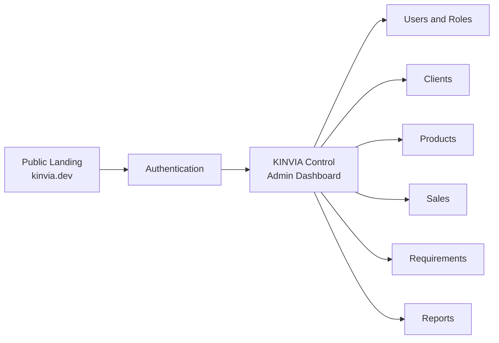
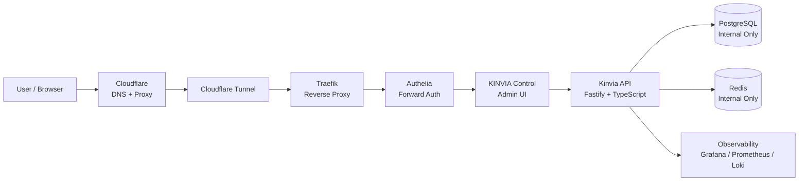
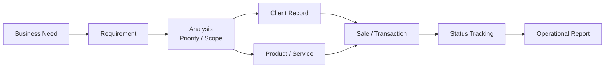
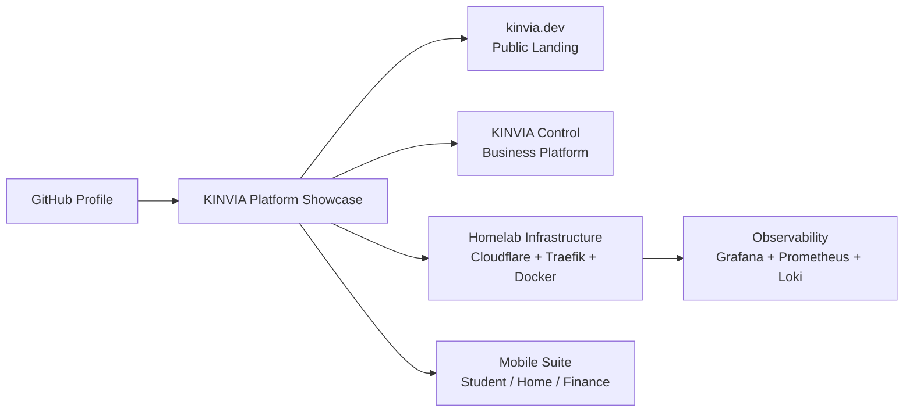

# KINVIA Control Flows

KINVIA Control is the business application layer of the KINVIA ecosystem. It connects the public product presence, administrative interface, business modules, backend services, and infrastructure platform.

---

## 1. Functional Flow



Purpose:

- Show that KINVIA Control is more than a landing page.
- Present it as an internal business platform.
- Highlight admin, CRM, catalog, sales, and workflow modules.

---

## 2. SaaS Architecture Flow



Purpose:

- Document the future SaaS path.
- Keep databases private inside the Docker network.
- Show Cloudflare, Traefik, and Authelia as the public edge and access layer.

---

## 3. Business Process Flow



Purpose:

- Explain the business workflow behind the UI.
- Position KINVIA Control as a line-of-business system.
- Demonstrate operational thinking beyond simple CRUD screens.

---

## 4. Portfolio Narrative Flow



Purpose:

- Guide recruiters or clients through the story.
- Connect GitHub, landing page, control platform, infrastructure, observability, and mobile apps.
- Present the ecosystem as a complete platform instead of isolated repositories.

---

## Recommended Showcase Screenshots

Use screenshots from the video in this order:

1. KINVIA Control dashboard
2. Users / roles administration
3. Clients module
4. Products module
5. Sales module
6. Requirements or workflow module
7. Public landing page

Recommended naming:

```text
screenshots/control-dashboard.png
screenshots/control-users.png
screenshots/control-clients.png
screenshots/control-products.png
screenshots/control-sales.png
screenshots/control-requirements.png
screenshots/landing-page.png
```

---

## Positioning

KINVIA Control should be presented as the business application layer of KINVIA:

- Administrative dashboard
- Business modules
- Operational workflows
- Future SaaS backend integration
- Infrastructure-backed deployment model

This makes the portfolio stronger because it shows not only infrastructure, but also a real business application running on top of that infrastructure.
