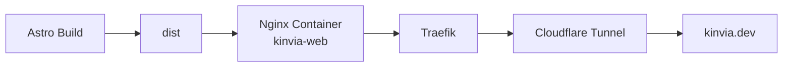
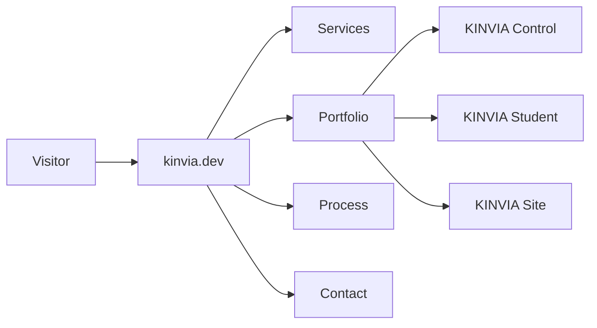

# KINVIA Landing Site

KINVIA Site is the public commercial entry point of the KINVIA ecosystem.

It is built with Astro, TypeScript and Tailwind CSS, and is deployed through the KINVIA homelab using Nginx, Traefik and Cloudflare Tunnel.

---

## Purpose

The landing site is designed to explain what KINVIA builds and to convert visitors into project conversations.

It presents KINVIA as a software development studio focused on:

- Web development
- Mobile applications
- Internal systems
- APIs
- Integrations
- Automation
- Product support and evolution

---

## Public URLs

```text
https://kinvia.dev
https://www.kinvia.dev
https://kinvia.dev/en
```

---

## Content Architecture

The current landing includes:

- Hero section
- Trust bar
- Problems and solutions
- Services
- Project types
- Portfolio
- Process
- Trust signals
- Why KINVIA
- Tech stack
- Contact section
- Legal pages
- Spanish and English content

---

## Portfolio Items

The public landing highlights:

- KINVIA Student
- KINVIA Control
- KINVIA Site

This is important because it connects the public brand to the real product ecosystem.

---

## Deployment Flow



---

## Role in the Platform



---

## Engineering Notes

- The site uses Astro for static performance.
- Tailwind CSS is used for design consistency.
- Content is separated into ES/EN dictionaries.
- Sections are componentized for maintainability.
- HTTPS redirects should be validated after each deployment.
- The landing does not include backend, authentication or dashboard logic.

---

## Showcase Value

This project supports the portfolio narrative because it proves that KINVIA is not only an infrastructure experiment. It also has a public product and commercial surface that communicates services, projects, process and contact flow.
