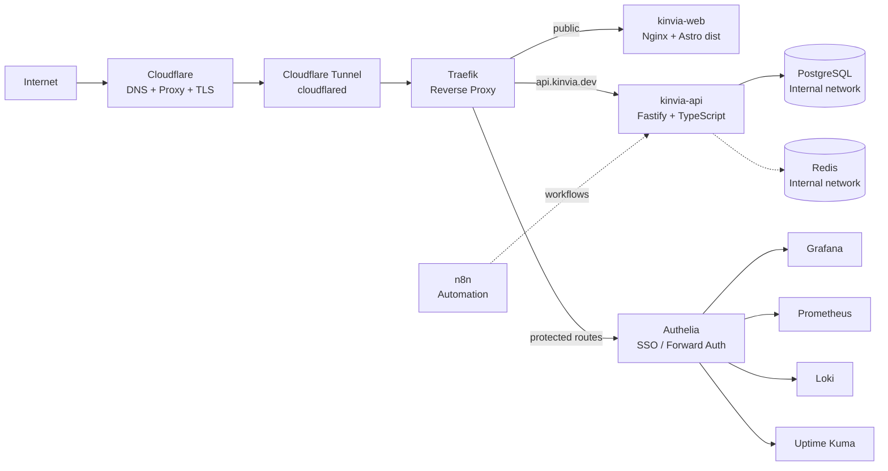
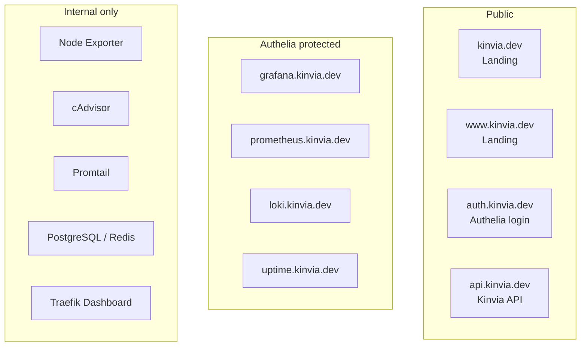
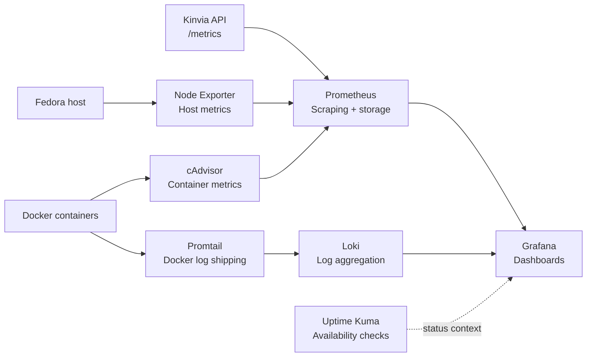
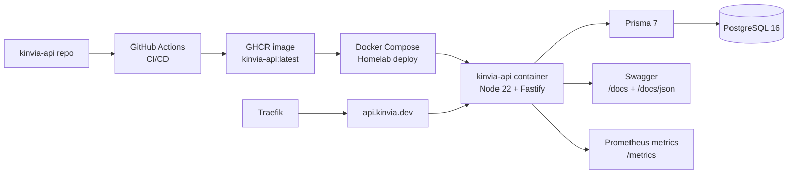
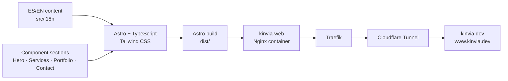

# Real Architecture Diagrams

These diagrams document the current KINVIA platform architecture based on the homelab, API, landing and platform showcase repositories.

---

## 1. Real Platform Architecture

---

## 2. External Exposure Matrix

---

## 3. Observability Architecture

---

## 4. API Runtime and Delivery Flow

---

## 5. Landing Site Delivery Flow

---

## Notes

- Public traffic enters through Cloudflare DNS/Proxy/TLS and Cloudflare Tunnel.
- Traefik is the main reverse proxy inside the homelab.
- Authelia protects observability and internal-facing tools.
- PostgreSQL and Redis are internal services and should not be exposed directly.
- Grafana, Prometheus, Loki and Uptime Kuma make up the operational visibility layer.
- KINVIA Site is the public commercial surface.
- KINVIA API is the backend foundation for future SaaS capabilities.
